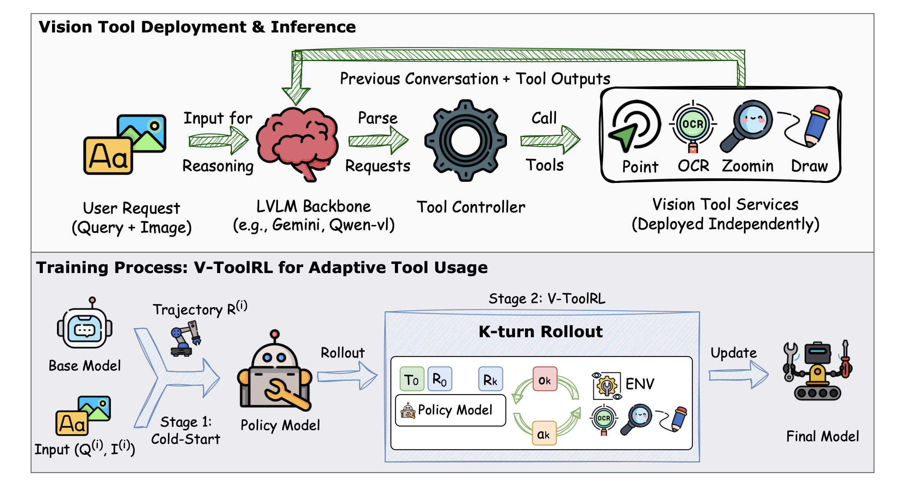
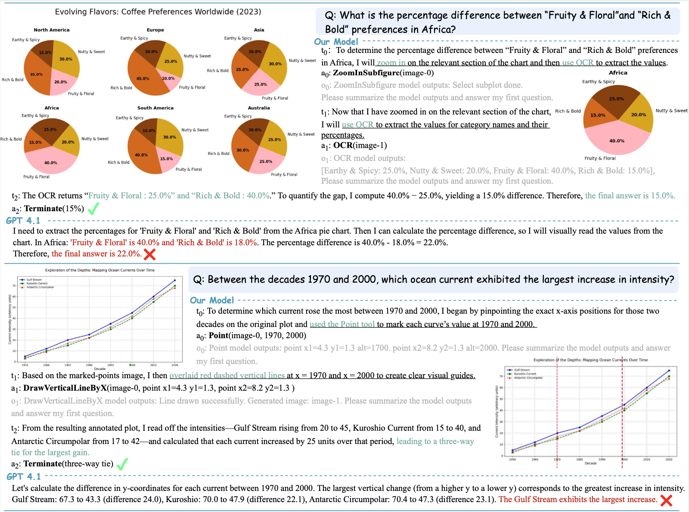

# GFlowTool / OpenThinkIMG Operator Guide

This README is a practical guide for running the parts of this repo that matter operationally:

1. `tool_server`: launch the vision-tool backend and prepare its weights.
2. `r1_v/open_r1/tool_grpo.py`: run tool-augmented GRPO training.
3. `r1_v/open_r1/tool_gfn_tb.py`: run tool-augmented GFlowNet trajectory-balance training.
4. `tool_server/tf_eval`: run evaluation, including `pass@k` and semantic diversity on ChartGemma-style outputs.

The codebase still contains the original OpenThinkIMG paper-oriented material, but this guide is written around the actual entrypoints and configs in this checkout.

## Links

- [SFT]([<SFT_CHECKPOINT_LINK>](https://mbzuaiac-my.sharepoint.com/:f:/g/personal/mohamed_abouelhadid_mbzuai_ac_ae/IgA0PjD3pIA4SoQpdP0dIASZAYx8gQbYM0TNTlksfYTjLig?e=1NrZCa))
- [GRPO](https://mbzuaiac-my.sharepoint.com/:f:/g/personal/mohamed_abouelhadid_mbzuai_ac_ae/IgDtTfqtv-jYSpV1tczsQkrzAc5rwJUJUImGWTdUbF_EZ1s?e=eqbrCI)
- [GFlowNets](https://mbzuaiac-my.sharepoint.com/:f:/g/personal/mohamed_abouelhadid_mbzuai_ac_ae/IgA2Rv_zCC8IRLe0WbTQjJ7HAa4wUv5HSa4mC_lNzPvaK38?e=Eym06D)
- [Dataset]([<DATASET_LINK>](https://huggingface.co/collections/Warrieryes/openthinkimg))

## Repository Layout

The repo is organized into three main subsystems:

- `tool_server/tool_workers`: the distributed vision-tool backend.
- `tool_server/tf_eval`: inference and evaluation over tool-using trajectories.
- `r1_v/open_r1`: SFT, GRPO, and GFlowNet-TB training.

The most important files for day-to-day use are:

- `tool_server/tool_workers/scripts/launch_scripts/start_server_local.py`
- `tool_server/tool_workers/scripts/launch_scripts/start_server_config.py`
- `tool_server/tool_workers/scripts/launch_scripts/config/all_service_example_local.yaml`
- `r1_v/open_r1/tool_grpo.py`
- `r1_v/open_r1/tool_gfn_tb.py`
- `r1_v/open_r1/run_tool_gfn_tb_torchrun.sh`
- `tool_server/tf_eval/__main__.py`
- `tool_server/tf_eval/tasks/chartgemma/config.yaml`

## 1. Tool Server Setup

The tool server must be running before:

- `tool_grpo.py` with `--use_tool true`
- `tool_gfn_tb.py`
- `tool_server.tf_eval`

### 1.1 Create a Tool-Server Environment

The tool server is intended to run in its own environment. The original README recommends a PyTorch `cu118` stack, and that matches the current tool worker dependencies.

```bash
conda create -n tool-server python=3.10
conda activate tool-server

pip install torch==2.0.1 torchvision==0.15.2 torchaudio==2.0.2 --index-url https://download.pytorch.org/whl/cu118

git clone https://github.com/OpenThinkIMG/OpenThinkIMG.git
cd OpenThinkIMG
pip install -e .
pip install -r requirements/tool_server_requirements.txt
```

Notes:

- `sam2` is required by `SegmentRegionAroundPoint`, but for this repo it is better to clone it into `models/src/sam-2` and install it from there in the next step.
- `requirements/tool_server_requirements.txt` is the actual requirements file in this repo.
- The local launch configs in this checkout assume the repo lives at `/share_5/users/mohamed_atef/OpenThinkIMG`; update those paths for your machine.

### 1.2 Rebuild the `models/` Folder From Scratch

The `models/` folder is not meant to be uploaded to GitHub. If you clone this repo on a new machine, recreate it before launching the tool server.

The local config in this checkout expects a layout like this:

```text
models/
├── Molmo-7B-D-0924/
├── groundingdino_swint_ogc.pth
├── GroundingDINO/
│   └── groundingdino/
│       └── config/
│           └── GroundingDINO_SwinT_OGC.py
└── src/
    └── sam-2/
        ├── checkpoints/
        │   └── sam2.1_hiera_large.pt
        └── sam2/
            └── configs/
                └── sam2.1/
                    └── sam2.1_hiera_l.yaml
```

Start by creating the base directories:

```bash
mkdir -p models
mkdir -p models/src
```

The tool workers in this repo need the following local assets:

#### Molmo Pointing Model

Used by the `Point` worker.

Clone or download `allenai/Molmo-7B-D-0924` into:

```bash
git lfs install
git clone https://huggingface.co/allenai/Molmo-7B-D-0924 models/Molmo-7B-D-0924
```

If you prefer `huggingface-cli`:

```bash
huggingface-cli download allenai/Molmo-7B-D-0924 --local-dir models/Molmo-7B-D-0924
```

This directory is referenced by:

- `tool_server/tool_workers/scripts/launch_scripts/config/all_service_example_local.yaml`
- `tool_server/tool_workers/online_workers/molmo_point_worker.py`

#### SAM2 Source Tree and Checkpoint

Used by `SegmentRegionAroundPoint`.

For this repo, do not rely only on a pip-installed `sam2` package. The local launch config also expects the SAM2 source tree under `models/src/sam-2` because it reads the YAML config file from that checkout.

1. Clone SAM2 into the expected location:

```bash
git clone https://github.com/facebookresearch/sam2.git models/src/sam-2
```

2. Install SAM2 from that local checkout:

```bash
pip install -e models/src/sam-2
```

3. Download the large SAM2 checkpoint into the expected `checkpoints/` directory:

```bash
mkdir -p models/src/sam-2/checkpoints
wget -P models/src/sam-2/checkpoints \
  https://dl.fbaipublicfiles.com/segment_anything_2/092824/sam2.1_hiera_large.pt
```

The final checkpoint path should be:

```text
models/src/sam-2/checkpoints/sam2.1_hiera_large.pt
```

4. The config file is expected at:

```text
models/src/sam-2/sam2/configs/sam2.1/sam2.1_hiera_l.yaml
```

That config file normally comes from the cloned SAM2 repo, so you should not need to create it manually.

If you use a different SAM2 checkout or checkpoint location, update the paths in:

- `tool_server/tool_workers/scripts/launch_scripts/config/all_service_example_local.yaml`
- `tool_server/tool_workers/online_workers/SAMAroundPoint_worker.py`

#### GroundingDINO Source Tree and Checkpoint

Used by the `GroundingDINO` worker.

You need both:

- the GroundingDINO Python package/source tree
- the pretrained checkpoint

Clone the repo into the local `models/` folder:

```bash
git clone https://github.com/IDEA-Research/GroundingDINO.git models/GroundingDINO
```

Install it from source:

```bash
cd models/GroundingDINO
rm -f pyproject.toml
pip install -e .
cd ../..
python -c "import groundingdino._C"
```

If the import fails with a missing `libc10.so`, follow the old project note and add your PyTorch library directory to `LD_LIBRARY_PATH`.

Then download the checkpoint file to:

```bash
wget -O models/groundingdino_swint_ogc.pth \
  https://github.com/IDEA-Research/GroundingDINO/releases/download/v0.1.0-alpha/groundingdino_swint_ogc.pth
```

The final checkpoint path should be:

```text
models/groundingdino_swint_ogc.pth
```

The worker also expects the model config file at:

```text
models/GroundingDINO/groundingdino/config/GroundingDINO_SwinT_OGC.py
```

That config file normally comes from the cloned GroundingDINO repo, so you should not need to download it separately.

The original project used the following official sources:

- checkpoint URL:
  `https://github.com/IDEA-Research/GroundingDINO/releases/download/v0.1.0-alpha/groundingdino_swint_ogc.pth`
- config URL:
  `https://github.com/IDEA-Research/GroundingDINO/blob/main/groundingdino/config/GroundingDINO_SwinT_OGC.py`

These paths are consumed by:

- `tool_server/tool_workers/scripts/launch_scripts/config/all_service_example_local.yaml`
- `tool_server/tool_workers/online_workers/grounding_dino_worker.py`

#### Tools That Do Not Need a Local `models/` Payload

- `OCR` uses `easyocr` and downloads its own assets automatically.
- `DrawHorizontalLineByY` and `DrawVerticalLineByX` are lightweight and do not need model weights.
- `ZoomInSubfigure` currently does not use a local model checkpoint, but it does rely on an external Gemini API call in the current implementation.

### 1.3 Verify the `models/` Folder Before Launching

Before starting the tool server, verify that these paths exist:

```bash
ls models/Molmo-7B-D-0924
ls models/groundingdino_swint_ogc.pth
ls models/GroundingDINO/groundingdino/config/GroundingDINO_SwinT_OGC.py
ls models/src/sam-2/checkpoints/sam2.1_hiera_large.pt
ls models/src/sam-2/sam2/configs/sam2.1/sam2.1_hiera_l.yaml
```

### 1.4 Check and Edit the Local Launch Config

The easiest starting point is:

- `tool_server/tool_workers/scripts/launch_scripts/config/all_service_example_local.yaml`

Before launching, edit at least:

- `base_dir`
- `log_folder`
- every `script-addr` path if your repo root differs
- every model/checkpoint path under `cmd`
- `cuda_visible_devices`
- any `conda_env` names

The tool names exposed by the default local config are:

- `Point`
- `SegmentRegionAroundPoint`
- `OCR`
- `GroundingDINO`
- `DrawHorizontalLineByY`
- `DrawVerticalLineByX`
- `ZoomInSubfigure`

### 1.5 Launch the Tool Server Locally

```bash
cd tool_server/tool_workers/scripts/launch_scripts
python start_server_local.py --config ./config/all_service_example_local.yaml
```

What this does:

- starts the controller
- launches each worker process
- waits for workers to register
- writes the controller address JSON file used by default clients

By default, the controller address is written to:

```text
tool_server/tool_workers/online_workers/controller_addr/controller_addr.json
```

This matters because:

- `tf_eval` currently relies on that default controller address file
- the training code can use either the JSON file path or a direct URL via `--controller_addr`

### 1.6 Launch Through SLURM

If you want the original SLURM-style orchestration instead of local processes:

```bash
cd tool_server/tool_workers/scripts/launch_scripts
python start_server_config.py --config ./config/all_service_example.yaml
```

Use the SLURM config path only after adapting its partition, environment, and filesystem settings.

### 1.7 Quick Sanity Check

After startup, check that the controller is alive and workers registered:

```bash
python tool_server/tool_workers/online_workers/test_cases/worker_tests/test_all.py
```

If training or evaluation cannot find tools:

- verify the controller is reachable
- verify the workers registered with the controller
- verify the controller address file exists
- verify the configured tool names match the model prompt exactly

## 2. GRPO Training

### 2.1 What Script to Run

The main GRPO training entrypoint is:

```text
r1_v/open_r1/tool_grpo.py
```

This file:

- loads the JSON dataset
- converts `label` to `solution`
- loads images from `image_path`
- builds the multimodal conversation format
- chooses the trainer implementation
- runs GRPO with or without tools

For tool-augmented GRPO, the important flags are:

- `--use_tool true`
- `--use_vllm true`
- `--controller_addr ...`

### 2.2 Create a Training Environment

The GRPO path depends on the training stack in `requirements/train_requirements.txt`, and the vLLM-backed variants also need a recent CUDA/PyTorch/vLLM setup.

A practical setup is:

```bash
conda create -n gflowtool-train python=3.10
conda activate gflowtool-train

pip install torch==2.5.1 torchvision==0.20.1 torchaudio==2.5.1 --index-url https://download.pytorch.org/whl/cu121

git clone https://github.com/OpenThinkIMG/OpenThinkIMG.git
cd OpenThinkIMG
pip install -e .
pip install -r requirements/train_requirements.txt
```

If you use FlashAttention, vLLM, DeepSpeed, or bitsandbytes versions different from the original environment, keep them internally consistent with your CUDA version.

### 2.3 Dataset Format

The GRPO script expects a JSON or JSONL dataset passed through `--dataset_name`. In this repo, an example training file is:

```text
tool_dataset/records.jsonl
```

Each record looks like:

```json
{"image_path": "/abs/path/to/image.png", "question": "How many bars are there in the graph?", "label": "<answer> 3 </answer>"}
```

Required fields for the current path are:

- `image_path`
- `question` by default, or another field if you change `--query_key`
- `label` or `solution`

### 2.4 Model Checkpoint to Start From

Set `--model_name_or_path` to the checkpoint you want to continue training from.

Common choices:

- a base Qwen2-VL or Qwen2.5-VL checkpoint
- an SFT checkpoint such as `output/Qwen2.5-VL_sft`

### 2.5 Paths You Usually Need to Change

For GRPO, you will usually edit:

- `--model_name_or_path`
- `--dataset_name`
- `--output_dir`
- `--deepspeed`
- `--controller_addr`
- `--vllm_device`
- `--run_name`

If you move the repo, also update any absolute paths inside your shell scripts or DeepSpeed configs.

### 2.6 Minimal Tool-GRPO Command

This is the mainline tool-augmented GRPO path:

```bash
torchrun --nproc_per_node=2 \
  -m r1_v.open_r1.tool_grpo \
  --model_name_or_path /path/to/your/model \
  --dataset_name /path/to/your/train.jsonl \
  --output_dir /path/to/output/grpo_run \
  --deepspeed /share_5/users/mohamed_atef/OpenThinkIMG/r1_v/open_r1/dsz3.json \
  --max_prompt_length 16000 \
  --max_completion_length 2048 \
  --num_generations 8 \
  --per_device_train_batch_size 2 \
  --gradient_accumulation_steps 12 \
  --learning_rate 1e-6 \
  --lr_scheduler_type constant \
  --bf16 true \
  --gradient_checkpointing true \
  --attn_implementation flash_attention_2 \
  --report_to wandb \
  --save_steps 100 \
  --num_train_epochs 1 \
  --use_vllm true \
  --vllm_device cuda:2 \
  --vllm_gpu_memory_utilization 0.8 \
  --use_tool true \
  --controller_addr http://localhost:20201 \
  --reward_funcs accuracy,format \
  --run_name grpo_tool_run
```

Important notes:

- `tool_grpo.py` expects the tool server to already be up.
- The tool runtime uses the `safe` variant by default.
- If `--controller_addr` points to a JSON file path, it will read the controller URL from it; if it points directly to a URL, it will use the URL as-is.

### 2.7 Optional Step-Judge GRPO

There is also a step-judge reward path built on top of tool-vLLM-GRPO. Enable it with:

- `--use_step_judge_reward true`

That path uses:

- `r1_v/open_r1/trainer/tool_vllm_grpo_trainer_step_judge.py`
- `r1_v/open_r1/trainer/turn_judge.py`

Use it only if you intentionally want semantic per-turn judging, because it adds another large judge model into the loop.

## 3. GFlowNet-TB Training

### 3.1 What Script to Run

The GFlowNet training entrypoint is:

```text
r1_v/open_r1/tool_gfn_tb.py
```

This path trains a tool-using policy with a trajectory-balance objective over complete trajectories.

### 3.2 Recommended Launch Script

This repo already contains a runnable template:

```text
r1_v/open_r1/run_tool_gfn_tb_torchrun.sh
```

That script is the best starting point because it already exposes the main variables you need to change.

### 3.3 Paths and Variables You Need to Change

Open `r1_v/open_r1/run_tool_gfn_tb_torchrun.sh` and update at least:

- `MODEL_NAME_OR_PATH`
- `DATASET_JSON`
- `OUTPUT_DIR`
- `DEEPSPEED_CONFIG`
- `CONTROLLER_ADDR`
- `CUDA_VISIBLE_DEVICES`
- `VLLM_DEVICE`
- `WANDB_*`

You will probably also tune:

- `MAX_ROUNDS`
- `NUM_GENERATIONS`
- `TEMPERATURE`
- `TOP_P`
- `TOP_K`
- `REWARD_ACCURACY_WEIGHT`
- `REWARD_FORMAT_WEIGHT`
- `REPLAY_BUFFER_SIZE`
- `REPLAY_SAMPLING`
- `ROLLOUT_SYNC_INTERVAL`

### 3.4 What the GFlowNet Script Requires

`tool_gfn_tb.py` requires:

- `--use_vllm true`
- a running tool server
- a checkpoint to fine-tune from
- a dataset with image paths and labels

It also supports:

- `--finetune_mode lora|full`
- `--freeze_vision_tower true|false`
- prompt-conditioned `logZ` via the built-in `gfn_logz_head`
- replay-buffer training over full trajectories

### 3.5 Run the Existing Torchrun Template

```bash
bash r1_v/open_r1/run_tool_gfn_tb_torchrun.sh
```

### 3.6 Minimal Direct Command

If you want to call the module directly instead of using the shell script:

```bash
torchrun --standalone --nproc_per_node 2 \
  -m r1_v.open_r1.tool_gfn_tb \
  --model_name_or_path /path/to/your/model \
  --dataset_name /path/to/your/train.jsonl \
  --output_dir /path/to/output/gfn_run \
  --deepspeed /path/to/r1_v/open_r1/deepspeed_zero2_tool_tbgfn.json \
  --finetune_mode full \
  --freeze_vision_tower true \
  --max_rounds 6 \
  --num_generations 2 \
  --reward_accuracy_weight 3.0 \
  --reward_format_weight 0.25 \
  --reward_epsilon 1e-4 \
  --replay_buffer_size 1000 \
  --replay_sampling prioritized \
  --replay_priority_alpha 0.0 \
  --rollout_sync_interval 1 \
  --learning_rate 5e-6 \
  --logZ_lr 1e-3 \
  --per_device_train_batch_size 1 \
  --gradient_accumulation_steps 8 \
  --max_prompt_length 8192 \
  --max_completion_length 1024 \
  --temperature 0.4 \
  --top_p 0.9 \
  --top_k 20 \
  --use_vllm true \
  --vllm_device cuda:2 \
  --vllm_gpu_memory_utilization 0.5 \
  --controller_addr http://localhost:20201 \
  --bf16 true \
  --gradient_checkpointing true \
  --report_to wandb \
  --run_name gfn_tb_run
```

### 3.7 Trajectory Logging

The GFlowNet trainer can log sampled trajectories to JSONL. Useful flags are:

- `--trajectory_log_path`
- `--trajectory_log_every_steps`
- `--trajectory_log_num_samples`
- `--trajectory_log_include_turn_records`
- `--trajectory_log_max_text_chars`

These logs are especially useful for debugging bad tool use, replay quality, and reward composition.

## 4. pass@k and Semantic Diversity Evaluation

The pass@k and semantic diversity metrics live in the `tf_eval` path, not in the training scripts.

The relevant implementation is:

- `tool_server/tf_eval/utils/chartgemma_metrics.py`

The ChartGemma task returns:

- per-sample records
- `pass@k`
- `semantic_diversity@N`
- optional `semantic_diversity@N_correct_only`

### 4.1 Create an Evaluation Environment

If you want a separate evaluation env:

```bash
conda create -n gflowtool-eval python=3.10
conda activate gflowtool-eval

pip install torch==2.5.1 torchvision==0.20.1 torchaudio==2.5.1 --index-url https://download.pytorch.org/whl/cu121

git clone https://github.com/OpenThinkIMG/OpenThinkIMG.git
cd OpenThinkIMG
pip install -e .
pip install -r requirements/inference_requirements.txt
```

`requirements/inference_requirements.txt` already includes:

- `sentence-transformers`
- `thefuzz`

which are used by the ChartGemma metrics code.

### 4.2 Important Caveat About Controller Address in `tf_eval`

The current `tf_eval` inferencer constructs `ToolManager()` without forwarding `--controller_addr`, so in practice it relies on the default controller address JSON written by the tool-server launch scripts.

That means:

- launch the tool server first
- make sure `tool_server/tool_workers/online_workers/controller_addr/controller_addr.json` exists and points to the live controller

### 4.3 Single-Run Evaluation

Basic example:

```bash
accelerate launch --config_file configs/accelerate.yaml \
  -m tool_server.tf_eval \
  --model vllm_models \
  --model_args pretrained=/path/to/model,tensor_parallel=1,limit_mm_per_prompt=1 \
  --task_name chartgemma \
  --batch_size 1 \
  --max_rounds 6 \
  --num_generations 1 \
  --do_sample false \
  --temperature 0.0 \
  --output_path ./outputs/chartgemma_eval_summary.jsonl \
  --sample_output_path ./outputs/chartgemma_eval_samples.jsonl
```

### 4.4 Recommended YAML Config for pass@k and Semantic Diversity

Create a config like this:

```yaml
- model_args:
    model: vllm_models
    model_args: pretrained=/path/to/your/model,tensor_parallel=1,limit_mm_per_prompt=1
    batch_size: 1
    max_rounds: 6
    stop_token: "<stop>"
  task_args:
    task_name: chartgemma
    save_to_ckpt:
      chartgemma: ./outputs/chartgemma_ckpt.jsonl
  generation_args:
    num_generations: 8
    max_completion_length: 1024
    do_sample: true
    temperature: 0.6
    top_p: 0.95
    top_k: 50
    repetition_penalty: 1.0
    seed: 42
  metric_args:
    pass_k_list: [1, 2, 4, 8]
    correctness_threshold: 1.0
    compute_semantic_diversity: true
    compute_correct_only_metrics: true
    semantic_diversity_model: sentence-transformers/paraphrase-MiniLM-L6-v2
    semantic_diversity_source: trajectory_text
    include_sample_records_in_summary: false
  script_args:
    verbosity: INFO
    output_path: ./outputs/chartgemma_passk_summary.jsonl
    sample_output_path: ./outputs/chartgemma_passk_samples.jsonl
```

Run it with:

```bash
accelerate launch --config_file configs/accelerate.yaml \
  -m tool_server.tf_eval \
  --config /path/to/your_passk_eval.yaml
```

### 4.5 How pass@k Is Computed

For each original prompt:

- `num_generations` samples are generated
- each sample is scored independently
- the task groups all samples with the same `prompt_idx`
- `pass@k` is computed using the unbiased estimator implemented in `chartgemma_metrics.py`

To get meaningful `pass@k`:

- set `generation_args.num_generations > 1`
- use stochastic decoding such as `do_sample: true`
- choose `pass_k_list` values less than or equal to `num_generations`

### 4.6 How Semantic Diversity Is Computed

Semantic diversity is computed from sentence embeddings over one text source per sample.

Available source choices include:

- `trajectory_text`: the full concatenated tool-using trajectory
- `final_response`: if you change the metric code or sample record source accordingly

The current default in ChartGemma is:

```yaml
semantic_diversity_source: trajectory_text
```

The metric:

- embeds all sampled texts for the same prompt
- computes pairwise cosine distances
- averages those distances

You can also enable correct-only diversity:

```yaml
compute_correct_only_metrics: true
```

### 4.7 Output Files

With the config above you usually get:

- `output_path`: one summary JSONL line per task/config
- `sample_output_path`: one JSONL row per sampled trajectory
- optional checkpoint JSONL if `save_to_ckpt` is set

The sample file is the easiest artifact to inspect when debugging:

- final answers
- per-sample scores
- number of rounds
- tool configs
- tool responses
- full trajectory text

## 5. Typical End-to-End Workflow

1. Create and test the tool-server environment.
2. Download tool weights and update the local service config.
3. Launch the tool server and verify the controller/workers.
4. Create a training environment and install `requirements/train_requirements.txt`.
5. Run SFT if you want a warm start.
6. Run `r1_v/open_r1/tool_grpo.py` for GRPO experiments.
7. Run `r1_v/open_r1/tool_gfn_tb.py` or `run_tool_gfn_tb_torchrun.sh` for GFlowNet-TB experiments.
8. Run `tool_server.tf_eval` with `num_generations > 1` to measure `pass@k` and semantic diversity.

## 6. Common Failure Modes

- Tool server starts but tools are missing:
  Usually a worker failed to initialize because a checkpoint path or env name is wrong.
- Training hangs on rollout:
  Usually the controller is unreachable or the chosen `vllm_device` conflicts with training GPUs.
- `tf_eval` cannot find tools:
  Usually the controller address JSON was not written or points to an old controller.
- Semantic diversity crashes:
  Usually `sentence-transformers` is missing from the eval env or the selected model cannot be loaded.
- No meaningful `pass@k` variation:
  Usually `num_generations=1` or decoding is deterministic.

## 7. Files to Edit Most Often

- `tool_server/tool_workers/scripts/launch_scripts/config/all_service_example_local.yaml`
- `r1_v/open_r1/run_tool_gfn_tb_torchrun.sh`
- your GRPO launch command or shell wrapper around `r1_v/open_r1/tool_grpo.py`
- your `tf_eval` YAML config for pass@k/diversity runs

## 8. Citation

If you use the original OpenThinkIMG framework, cite the upstream paper and repository.

<!-- Legacy README retained below for reference.
<div align="center">
  
  <h1 align="center">Use Vision Tools, Think with Images</h1>

  <a href="https://arxiv.org/pdf/2505.08617">
    
  </a>
  <a href="https://github.com/OpenThinkIMG/OpenThinkIMG">
    
  </a>
  <a href="https://huggingface.co/collections/Warrieryes/openthinkimg-68244a63e97a24d9b7ffcde9">
    
  </a>
  <a href="https://x.com/suzhaochen0110/status/1922481570453074070?s=46">
    
  </a>
</div>


## 👁️ Vision: "Thinking with Images"

> *"The eye sees only what the mind is prepared to comprehend."* – Robertson Davies

Humans don't just passively observe; we actively engage with visual information, sketching, highlighting, and manipulating it to understand. OpenThinkIMG aims to bring this interactive visual cognition to AI, enabling agents that can genuinely "think with images."


<div align="center">
  
  <br>
  <em>Overview of the OpenThinkIMG framework and V-ToolRL training process.</em>
</div>


## News
- **[2025/06/30]** We have released ["Thinking with Images for Multimodal Reasoning: Foundations, Methods, and Future Frontiers"](https://arxiv.org/pdf/2506.23918), the **first comprehensive survey** dedicated to the emerging paradigm of "Think with Images". We also maintain a real-time [GitHub repository](https://github.com/zhaochen0110/Awesome_Think_With_Images/) tracking this progress (🔥 600+🌟).
- **[2025/06/01]** 🐳 We have released an official [Docker image](https://github.com/OpenThinkIMG/OpenThinkIMG?tab=readme-ov-file#-option-1-docker-image) of `tool server`.
- **[2025/05/17]** Our work is reported by [Qubit (量子位)](https://mp.weixin.qq.com/s/BU1M6aOidMkr9mBiAKyA3Q)
- **[2025/05/14]** Our work is reported by both [Deep Learning and NLP (深度学习自然语言处理)](https://mp.weixin.qq.com/s/_GCvkg7bb5-NiId_4s5cMg) and [Machine Learning and NLP (机器学习算法与自然语言处理)](https://mp.weixin.qq.com/s/p2OJzSp4BKSfGVjv2KWEFg).
- **[2025/05/13]** The models and datasets are released on [HuggingFace](https://huggingface.co/collections/Warrieryes/openthinkimg-68244a63e97a24d9b7ffcde9).
- **[2025/05/13]** OpenThinkIMG codebase is released along with evaluation scripts. Try it out!
- **[2025/05/13]** OpenThinkIMG paper available on [arXiv](https://arxiv.org/pdf/2505.08617).

---

## 🤔 What is OpenThinkIMG?

OpenThinkIMG is an end-to-end open-source framework that empowers Large Vision-Language Models (LVLMs) to think with images. It features:
*   Flexible vision tool management and easy integration of new tools.
*   Efficient dynamic inference with distributed tool deployment.
*   A streamlined SFT (Supervised Fine-Tuning) and Agent-RL (Reinforcement Learning) training pipeline, including our novel **V-ToolRL** method.

Our goal is to enable AI agents to interactively use visual tools to decompose, analyze, and solve complex visual problems, moving beyond passive observation towards active visual cognition.

---

## 🐚 Why OpenThinkIMG?

Current LVLMs excel at many tasks but often struggle when:
*   Deep, iterative visual reasoning is required, not just single-pass description.
*   Precise interaction with visual content (e.g., reading specific chart values, identifying exact locations) is crucial.
*   Generalizing learned tool-use to new scenarios dynamically.

OpenThinkIMG addresses these challenges by:

*   **Bridging the Gap to Human-like Visual Cognition**: We enable LVLMs to "think with images" by actively using a suite of visual tools, much like humans use sketches or highlights to understand complex scenes.
*   **Standardizing a Fragmented Landscape**: The current ecosystem for vision tools lacks unification. OpenThinkIMG provides:
    *   **Unified Tool Interfaces**: A standardized way to define and interact with diverse visual tools.
    *   **Modular, Distributed Deployment**: Tools run as independent services, enhancing scalability, fault isolation, and resource management.
*   **Moving Beyond Static SFT Limitations**: Supervised Fine-Tuning (SFT) on fixed trajectories often leads to poor generalization and lacks adaptability. We introduce:
    *   **V-ToolRL for Adaptive Policies**: Our novel reinforcement learning framework allows agents to *autonomously discover optimal tool-usage strategies* by directly optimizing for task success through interaction and feedback. This leads to significantly better performance and adaptability compared to SFT-only approaches.
*   **Driving Reproducible Research**: By open-sourcing the entire framework, we aim to provide a common platform for the community to build upon, experiment with, and advance the field of tool-augmented visual reasoning.

---

## 🚀 Quick Start
This framework comprises three main components: the fundamental tool service supplier ``tool server``, the inference evaluation framework `TF EVAL`, and the RL work ``R1-V-TOOL``. Each component has its own environment requirements. The `tool server` serves as the foundation and must be successfully launched before performing any inference or training.

### 🖥️ Step 1: Launch Vision Tool Server
You can either run our tool server using the provided `Docker image` or launch the `tool_server` locally, depending on your environment preferences.

### 🐳 Option 1: Docker Image
It's recommended to try our ``Tool Server`` docker image. You can either download our provided `tool_server` image or build it by your self!

📌 **Note:**
1. It’s recommended to use the `-v /path/to/your/logdir:/log` option to mount a host directory to the container’s `/log` directory, which allows you to view runtime logs and receive the `controller_addr` output.
2. The controller address is saved at ``/path/to/your/logdir/controller_addr.json``, which is no longer the default location. Make sure to provide this path to ``tool_manager`` when using it.
3. By default, the **molmoPoint** worker is configured to run in 4-bit mode to minimize VRAM usage. To customize GPU behavior or access advanced settings, you can log into the container and edit ``/app/OpenThinkIMG/tool_server/tool_workers/scripts/launch_scripts/config/service_apptainer.yaml``.

#### Option 1.1 Start Tool Server with Our Docker Image

We have released the docker image for `tool_server` and its slim version `tool_server_slim`. 

The `tool_server_slim` image is a lightweight version of the `tool_server` image, which removes the model weights to reduce the image size. To use it, manually prepare the model weights and place them under the `/weights` folder of the container as described in [Build Docker Image by Yourself](#option-12-build-docker-image-by-yourself) section. You can pull the image from either Aliyun or Docker Hub.

| Image         | Aliyun         | Docker Hub                  |
|------------------|-------------------|------------------------------------------|
| `tool_server`     | `crpi-fs6w5qkjtxy37mko.cn-shanghai.personal.cr.aliyuncs.com/hitsmy/tool_server:v0.1`             | `hitsmy/tool_server:v0.1`              |
| `tool_server_slim`| `crpi-fs6w5qkjtxy37mko.cn-shanghai.personal.cr.aliyuncs.com/hitsmy/tool_server_slim:v0.1`        | `hitsmy/tool_server_slim:v0.1`         |

```bash
# Pull the docker image and run
docker pull crpi-fs6w5qkjtxy37mko.cn-shanghai.personal.cr.aliyuncs.com/hitsmy/tool_server:v0.1
docker run -it \
  --gpus all \
  --name tool_server \
  -v /path/to/your/logdir:/log \
  -w /app/OpenThinkIMG \
  --network host \
  crpi-fs6w5qkjtxy37mko.cn-shanghai.personal.cr.aliyuncs.com/hitsmy/tool_server:v0.1 \
  bash -c \
  "python /app/OpenThinkIMG/tool_server/tool_workers/scripts/launch_scripts/start_server_local.py \
  --config /app/OpenThinkIMG/tool_server/tool_workers/scripts/launch_scripts/config/service_apptainer.yaml"

# Test the server 
pthon OpenThinkIMG/tool_server/tool_workers/online_workers/test_cases/worker_tests/test_all.py
```
#### Option 1.2 Build Docker Image by Yourself

We have provided the dockerfile at `OpenThinkIMG/Dockerfile`, you can build the docker Image according to it.

**sub-step 1** Prepare the weights


Some tools require specific pretrained weights. Please ensure that these model weights are prepared and placed in the appropriate paths before building the image. The image building process will copy them into the `/weights` folder of the container automatically.

The directory structure is organized as follows:

```bash
project-root/
├── weights/
│   ├── Molmo-7B-D-0924/ # allenai/Molmo-72B-0924
│   ├── sam2-hiera-large/ # facebook/sam2-hiera-large
│   ├── groundingdino_swint_ogc.pth # https://github.com/IDEA-Research/GroundingDINO/releases/download/v0.1.0-alpha/groundingdino_swint_ogc.pth
│   └── GroundingDINO_SwinT_OGC.py # https://github.com/IDEA-Research/GroundingDINO/blob/main/groundingdino/config/GroundingDINO_SwinT_OGC.py
├── OpenThinkIMG/
│   └── Dockerfile
```

**sub-step 2** Start the building procedure!

```bash 
git clone https://github.com/OpenThinkIMG/OpenThinkIMG.git
cd OpenThinkIMG
docker build -f Dockerfile -t tool_server:v0.1 ..  # This might take a while ...
```

**sub-step 3** Run the image and test!
```bash 
docker run -it \
  --gpus all \
  --name tool_server \
  -v /path/to/your/logdir:/log \
  -w /app/OpenThinkIMG/ \
  --network host \
  tool_server:v0.1 \

# Test the server 
pthon tool_server/tool_workers/online_workers/test_cases/worker_tests/test_all.py
```
### Option 2. Start Tool Server From Source Code
You can choose to start tool_server through SLURM or just run it on local machine.

### 🛠️ Installation
First of all, provide a pytorch-based environment.
* torch==2.0.1+cu118

```bash
# [Optional] Create a clean Conda environment
conda create -n tool-server python=3.10
conda activate tool-server
# Install PyTorch and dependencies (make sure CUDA version matches)
pip install -e git+https://github.com/facebookresearch/sam2.git
pip install torch==2.0.1 torchvision==0.15.2 torchaudio==2.0.2 --index-url https://download.pytorch.org/whl/cu118

# Install this project
git clone https://github.com/OpenThinkIMG/OpenThinkIMG.git
pip install -e OpenThinkIMG
pip install -r OpenThinkIMG/requirements/requirements.txt # Tool Server Requirements
```
⚠️ **Be aware:**

We **deliberately selected minimal dependencies** in this project to reduce the risk of conflicts. As a result, you may need to manually install any missing packages based on your environment.

#### Option 2.1 Start Tool Server through SLURM
It's recommended to start the tool server through SLURM because it's more flexible.
```bash
## First, modify the config to adapt to your own environment
## OpenThinkIMG/tool_server/tool_workers/scripts/launch_scripts/config/all_service_example.yaml

## Start all services
cd OpenThinkIMG/tool_server/tool_workers/scripts/launch_scripts
python start_server_config.py --config ./config/all_service_example.yaml

## Press Ctrl + C to shutdown all services automatically.
```

#### Option 2.2 Start Tool Server Locally
We made a slight modification to ``start_server_config.py`` to create ``start_server_local.py``, primarily by removing the logic related to SLURM job detection and adapting it for local execution instead.
```bash
## First, modify the config to adapt to your own environment
## OpenThinkIMG/tool_server/tool_workers/scripts/launch_scripts/config/all_service_example_local.yaml

## Start all services
cd OpenThinkIMG/tool_server/tool_workers/scripts/launch_scripts
python start_server_local.py --config ./config/all_service_example_local.yaml

## Press Ctrl + C to shutdown all services automatically.
```

You can then inspect the log files to diagnose and resolve any potential issues. Due to the complexity of this project, we cannot guarantee that it will run without errors on every machine.

### 🔍 Step 2: Run Inference with OpenThinkIMG

### 🛠️ Installation
First of all, provide a pytorch-vllm-based environment.
* vllm>=0.7.3
* torch==2.5.1+cu121
* transformers>=4.49.0
* flash_attn>=2.7.3

```bash
# [Optional] Create a clean Conda environment
conda create -n vllm python=3.10
conda activate tool-server
# Install PyTorch and dependencies (make sure CUDA version matches)
pip install torch==2.5.1 torchvision==0.20.1 torchaudio==2.5.1 --index-url https://download.pytorch.org/whl/cu121

# Install this project
git clone https://github.com/OpenThinkIMG/OpenThinkIMG.git
pip install -e OpenThinkIMG
pip install -r OpenThinkIMG/requirements/inference_requirements.txt # Tool Server Requirements
```

#### ✅ Option 1: Direct Evaluation (e.g., Qwen2VL on ChartGemma)

```bash
accelerate launch  --config_file  ${accelerate_config} \
-m tool_server.tf_eval \
--model qwen2vl \
--model_args pretrained=Qwen/Qwen2-VL-7B-Instruct \
--task_name chartgemma \
--verbosity INFO \
--output_path ./tool_server/tf_eval/scripts/logs/results/chartgemma/qwen2vl.jsonl \
--batch_size 2 \
--max_rounds 3 \
```

#### 🧩 Option 2: Evaluation via Config File (Recommended)


```bash
accelerate launch  --config_file  ${accelerate_config} \
-m tool_server.tf_eval \
--config ${config_file}
```

#### Config file example:

```yaml
- model_args:
    model: qwen2vl
    model_args: pretrained=Qwen/Qwen2-VL-7B-Instruct
    batch_size: 2
    max_rounds: 3
    stop_token: <stop>
  task_args:
    task_name: chartgemma
    resume_from_ckpt:
      chartgemma: ./tool_server/tf_eval/scripts/logs/ckpt/chartgemma/qwen2vl.jsonl
    save_to_ckpt:
      chartgemma: ./tool_server/tf_eval/scripts/logs/ckpt/chartgemma/qwen2vl.jsonl
  script_args:
    verbosity: INFO
    output_path: ./tool_server/tf_eval/scripts/logs/results/chartgemma/qwen2vl.jsonl
```

For detailed information and config setting please refer to our [documentation](docs/README.md).


## 🧠 Training

Once the vision tools are properly deployed, we provide a flexible training pipeline to teach models **how to plan and invoke tools** effectively through **SFT** and our proposed **V-ToolRL** methods.

Our training pipeline builds on the solid foundation of [OpenR1](https://github.com/OpenR1), integrating visual tools as external reasoning capabilities.

### 📦 Install Additional Dependencies

To run the training code, make sure to install the additional required packages:

```
pip install -r requirements/requirements_train.txt
```

### 🔁 V-ToolRL: Reinforcement Learning with Vision Tools

We provide a customized implementation of V-ToolRL for training models to leverage vision tools dynamically in complex tasks.

```
torchrun --nproc_per_node=${nproc_per_node} \
    --nnodes="1" \
    --node_rank="0" \
    --master_addr="127.0.0.1" \
    --master_port=${master_port} \
    src/open_r1/tool_grpo.py --use_vllm True \
    --output_dir ${output_dir} \
    --model_name_or_path ${model_path} \
    --dataset_name ${data_path} \
    --max_prompt_length 16000 \
    --max_completion_length 2048 \
    --temperature 1.0 \
    --seed 42 \
    --learning_rate 1e-6 \
    --num_generations 8 \
    --lr_scheduler_type "constant" \
    --vllm_gpu_memory_utilization 0.8 \
    --deepspeed ${DS_CONFIG} \
    --per_device_train_batch_size 2 \
    --gradient_accumulation_steps 12 \
    --logging_steps 1 \
    --bf16 true \
    --report_to wandb \
    --gradient_checkpointing true \
    --attn_implementation flash_attention_2 \
    --max_pixels 200000 \
    --num_train_epochs 1 \
    --run_name $RUN_NAME \
    --save_steps 100 \
    --save_only_model true \
    --controller_addr http://SH-IDCA1404-10-140-54-15:20001 \
    --use_tool true
```

> 📈  This helps the model learn **dynamic planning & tool invocation** using environment feedback.

### 🧪 SFT: Supervised Fine-Tuning

We also support supervised fine-tuning for training models on curated tool usage demonstrations. Modify the config according to your use case:

```
    accelerate launch --num_machines 1 --num_processes 6 --main_process_port 29502 --multi_gpu\
    src/open_r1/sft.py \
    --output_dir ${output_dir} \
    --model_name_or_path ${model_path} \
    --dataset_name ${data_path} \
    --seed 42 \
    --learning_rate 2e-5 \
    --max_seq_length 4096 \
    --deepspeed config/deepspeed/ds_z3_offload_config.json \
    --per_device_train_batch_size 2 \
    --gradient_accumulation_steps 8 \
    --logging_steps 1 \
    --report_to wandb \
    --gradient_checkpointing true \
    --attn_implementation flash_attention_2 \
    --bf16 \
    --num_train_epochs 2 \
    --run_name $RUN_NAME \
    --save_steps 100 \
    --warmup_ratio 0.1 \
    --save_only_model true
```


## 🚧 Project Status

OpenThinkIMG is currently an **alpha release** but is actively being developed. The core end-to-end system, including tool integration, trajectory generation, SFT (Cold-Start), and V-ToolRL training, is functional and can be used to replicate the results in our paper.

The project team is actively working on the following key milestones:

*   **🥇 Release of Pre-trained Models**: Providing readily usable SFT-initialized and V-ToolRL-trained agent models (e.g., based on Qwen2-VL-2B).
*   **🛠️ Expanding the Vision Toolset**: Integrating more diverse and powerful vision tools (e.g., advanced image editing, 3D analysis tools).
*   **🤖 Broader LVLM Backbone Support**: Adding easy integration for more open-source LVLMs (e.g., LLaVA series, MiniGPT-4).
*   **📊 More Benchmarks & Evaluation Suites**: Extending evaluation to a wider range of visual reasoning tasks beyond chart reasoning.
*   **🌐 Community Building**: Fostering an active community through GitHub discussions, contributions, and collaborations.

We welcome contributions and feedback to help us achieve these goals!

---


## 🔧 Vision Toolset

| **Tool**                    | **Input**                        | **Output**                             | **Description**                                                                                  |
|-----------------------------|----------------------------------|----------------------------------------|--------------------------------------------------------------------------------------------------|
| **GroundingDINO**           | image + text query               | bounding boxes                         | Object detection producing boxes for any target                                                  |
| **SAM**                     | image + bounding box             | segmentation mask                      | Generates precise segmentation masks based on provided regions                    |
| **OCR**                     | image                            | text strings + bounding boxes          | Optical character recognition for extracting text from images                                    |
| **Crop**                    | image + region coordinates       | cropped image                          | Extracts a sub-region of the image for focused analysis                                          |
| **Point**                   | image + target description       | point coordinates                      | Uses a model to predict the location of a specified object                                      |
| **DrawHorizontalLineByY**   | image + Y-coordinate             | annotated image                        | Draws a horizontal line at the given Y-coordinate                                                |
| **DrawVerticalLineByX**     | image + X-coordinate             | annotated image                        | Draws a vertical line at the given X-coordinate                                                  |
| **ZoominSubplot**           | image + description (title/pos)  | subplot images                 | Zoomin subplot(s) based on description                                                         |
| **SegmentRegionAroundPoint**| image + point coordinate         | localized mask                         | Refines segmentation around a specified point                                                    |
> 💡 More vision tools are coming soon!

## 📊 Results on Chart Reasoning (ChartGemma)
Our V-ToolRL approach significantly boosts performance:


| Model                          | Method       | Accuracy (%) |
| :----------------------------- | :----------- | :----------- |
| GPT-4.1       | Zero-shot    | 50.71        |
| Gemini-2.0-flash-exp   | Zero-shot    | 68.20        |
| ---                            | ---          | ---          |
| CogCom                         |  SFT (CoM)    | 15.07        |
| TACO                           | SFT (CoTA)   | 30.50        |
| ---                            | ---          | ---          |
| Qwen2-vl-2B                    | Zero-shot    | 29.56        |
| Qwen2-vl-2B-SFT      | SFT          | 45.67        |
| Text-based RL     | RL (No Vis)  | 51.63        |
| **V-ToolRL**    | **V-ToolRL** | **59.39**    |

V-ToolRL not only enhances our base model by +29.83 points but also outperforms other open-source tool-augmented agents and even strong closed-source models like GPT-4.1.


## 📂 Case Studies


<div align="center">
  
  <br>
  <em>An example demonstrating the step-by-step visual reasoning process of our V-ToolRL agent.</em>
</div>

## 🤝 Contributing

We welcome contributions of all kinds! In our [Documentation](docs/README.md) you’ll find detailed guides for:

- Importing custom models  
- Defining and integrating new vision tools  
- Extending the training pipeline  

To contribute:

1. **Fork** the repository and create a feature branch (e.g., `feature/new-vision-tool`).  
2. **Implement** your changes, adding or updating tests under `tests/`.  
4. **Submit** a pull request referencing the relevant issue, with clear descriptions and code snippets.  


## 🙏 Acknowledgments

We thank the [Visual Sketchpad](https://arxiv.org/abs/2406.09403) and [TACO](https://arxiv.org/abs/2402.05479) teams for inspiring our vision-driven reasoning paradigm.


## 📖 Citation

Please cite the following if you find OpenThinkIMG helpful:

```
@article{su2025openthinkimg,
  title={OpenThinkIMG: Learning to Think with Images via Visual Tool Reinforcement Learning},
  author={Su, Zhaochen and Li, Linjie and Song, Mingyang and Hao, Yunzhuo and Yang, Zhengyuan and Zhang, Jun and Chen, Guanjie and Gu, Jiawei and Li, Juntao and Qu, Xiaoye and others},
  journal={arXiv preprint arXiv:2505.08617},
  year={2025}
}
```


-->
